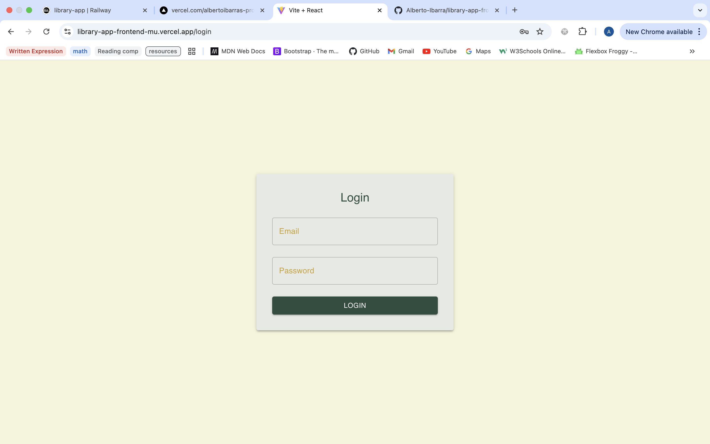
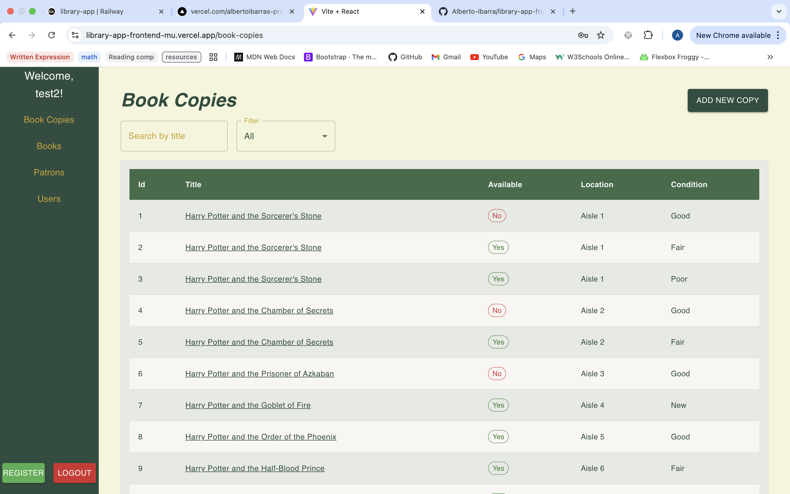
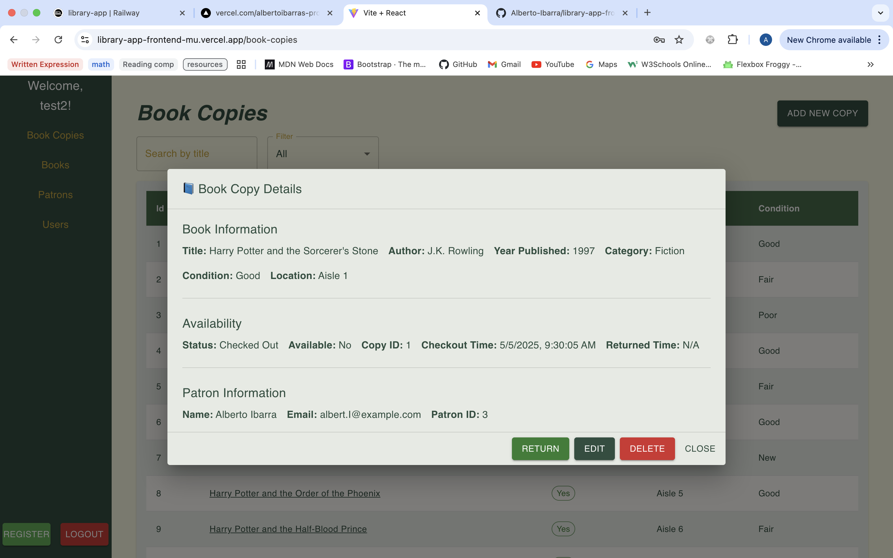
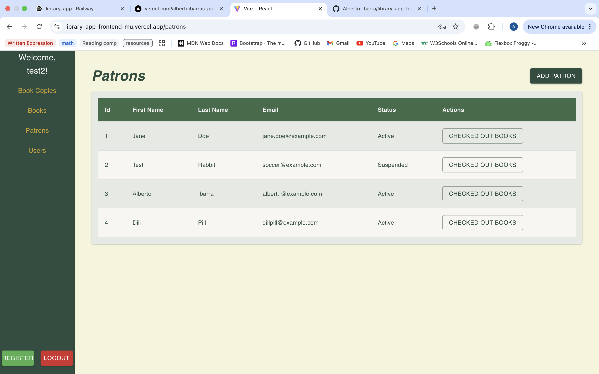
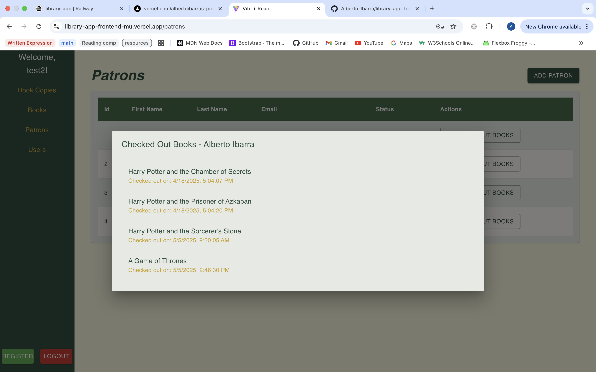
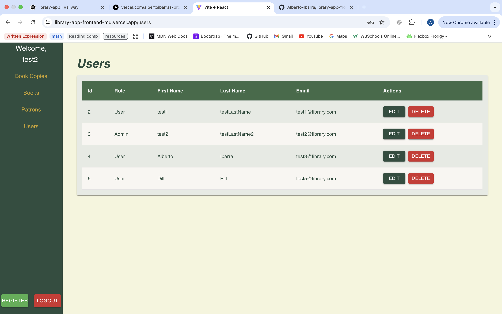

# 🏙️ Library App - Frontend

This is the frontend of the Library Management System. Built with React, Material UI, and Vite for fast bundling.

## 🔧 Tech Stack

- React.js
- Vite (for fast bundling and development)
- Material UI (for UI components)
- Axios (for making HTTP requests)
- Vercel (for deployment)

## 🚀 Live Application

- [Frontend on Vercel](https://library-app-frontend-mu.vercel.app)

## ⚙️ Setup Instructions

```bash
git clone https://github.com/yourusername/library-app-frontend.git
cd library-app-frontend
npm install
npm run dev

## 🖼️ Screenshots








