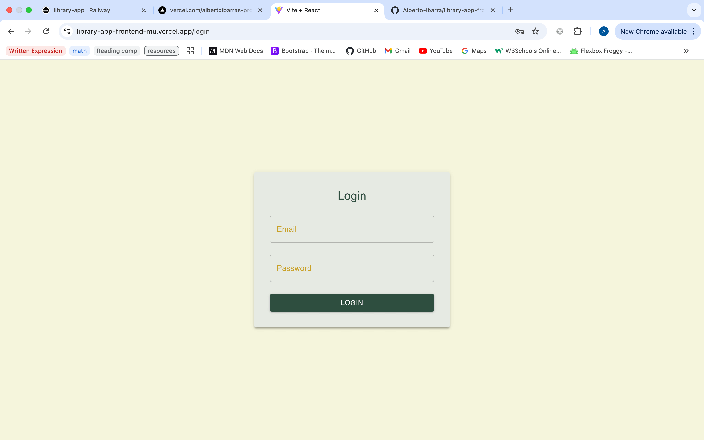
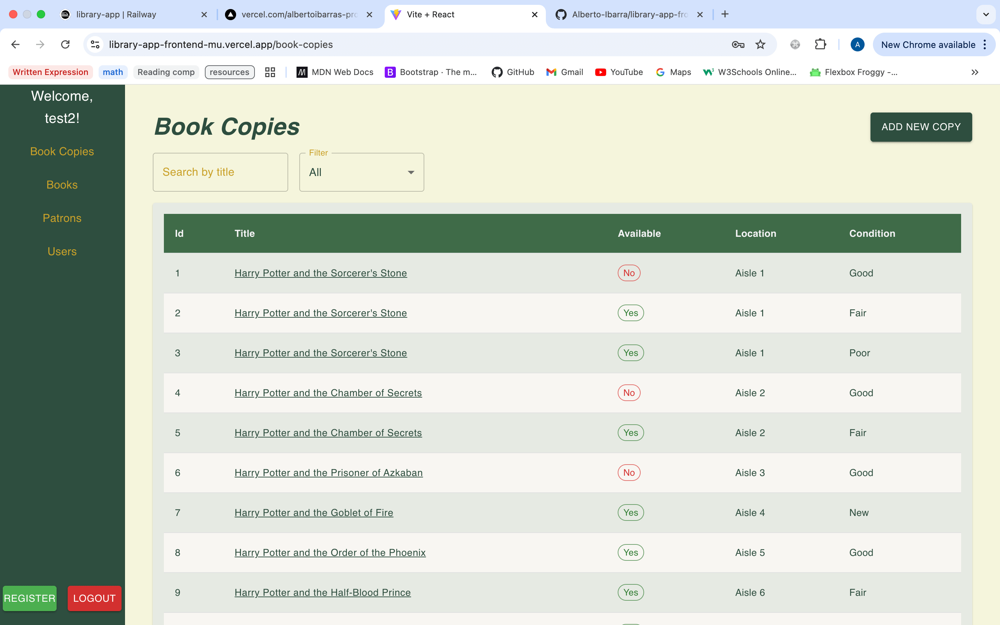
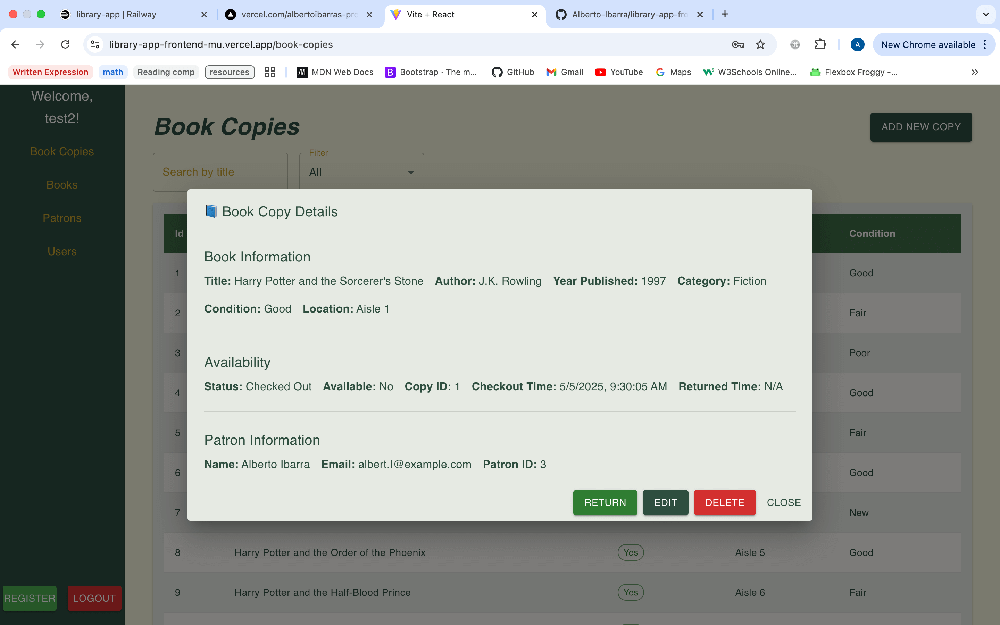
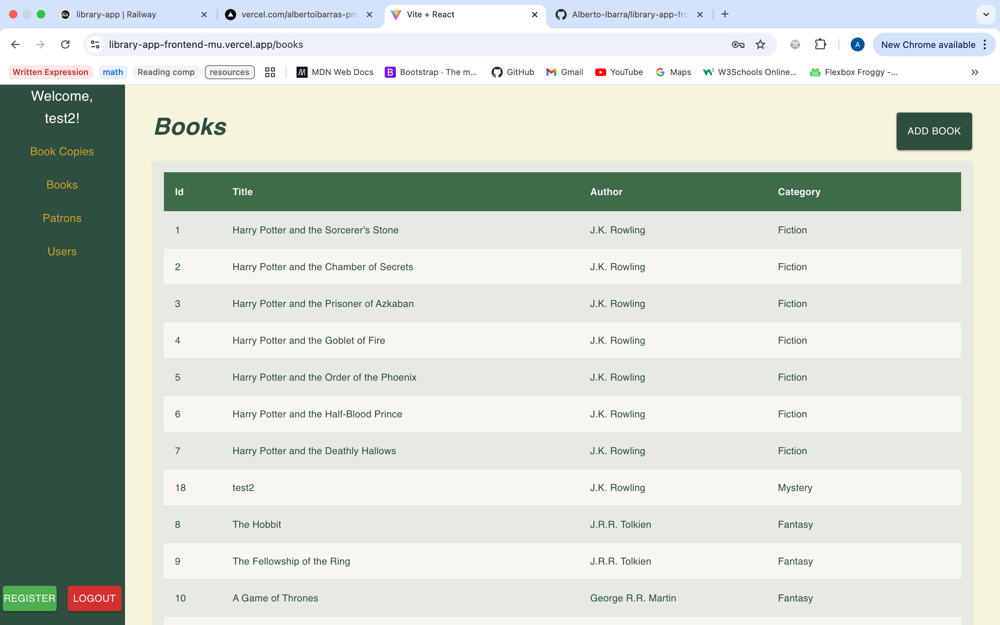
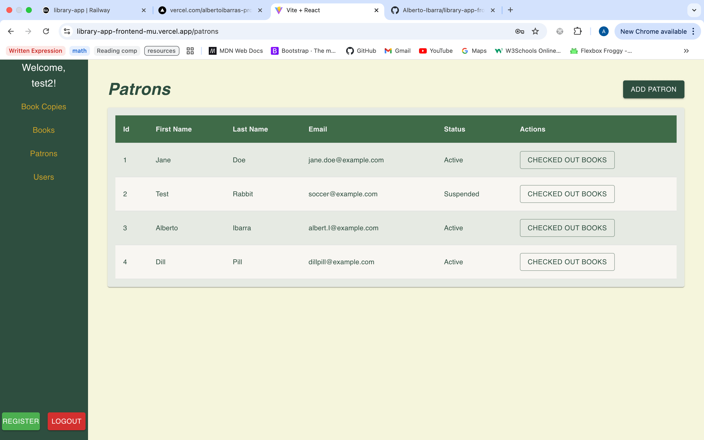
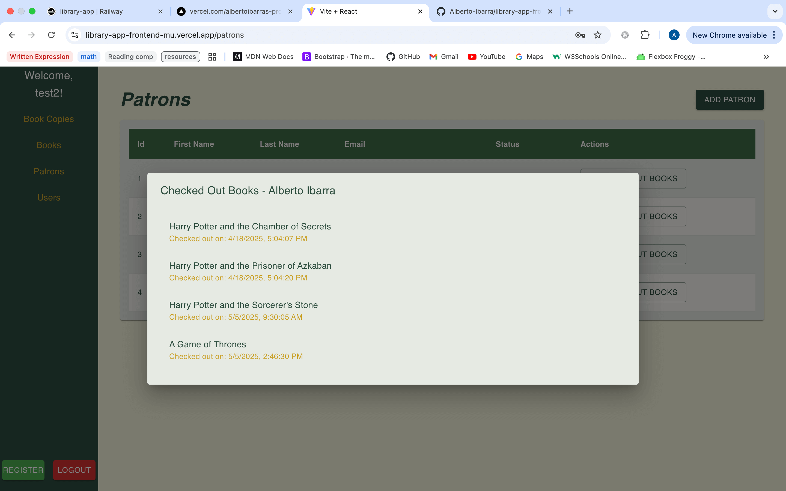
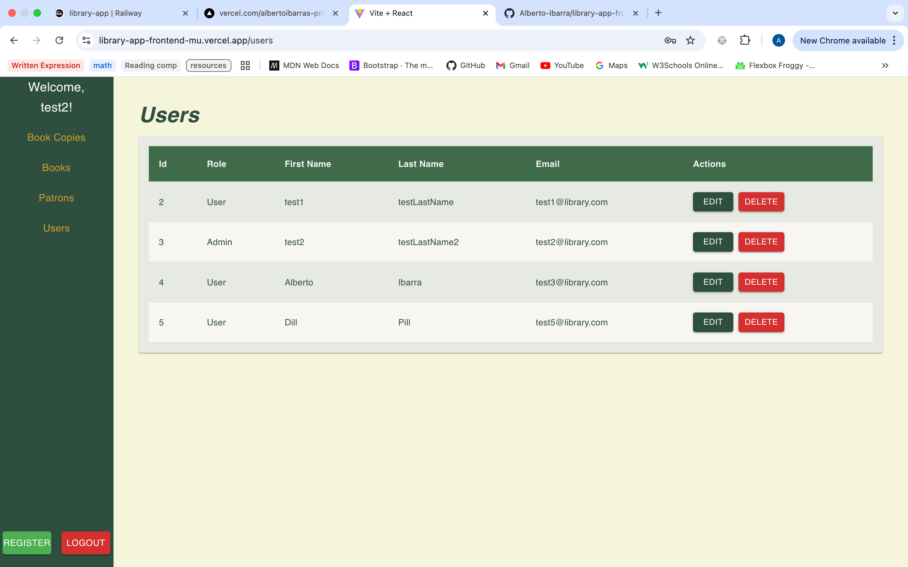

# 🏙️ Library App - Frontend

This is the frontend for the Library Management System, designed to simplify library operations such as managing books, patrons, and user accounts. The application provides both staff and admin users with tools to register patrons, manage inventory, and track book checkouts and returns — all through an intuitive web interface.

## 📌 Features

- 🔐 **Login & Registration**: Secure authentication for users. Admins can register and manage other users.
  
- 👤 **Admin Capabilities**: Admins can:
  - Register new users
  - View and manage existing users
  - Delete users as needed

- 📚 **Book Management (CRUD)**: Add, view, edit, and delete book copies. Includes full Create, Read, Update, and Delete functionality.

- 🔎 **Search & Filter**: Quickly search and filter book copies by title, author, or category.

- 📥 **Checkout & Return**: Seamlessly checkout and return books to/from patrons.

- 📄 **Patron Book List**: View all books currently checked out by any given patron.

## 🔧 Tech Stack

- React.js
- Vite (for fast bundling and development)
- Material UI (for UI components)
- Axios (for making HTTP requests)
- Vercel (for deployment)

## 🚀 Live Application

- [Frontend on Vercel](https://library-app-frontend-mu.vercel.app)

## ⚙️ Setup Instructions

```bash
git clone https://github.com/yourusername/library-app-frontend.git
cd library-app-frontend
npm install
npm run dev
```

## 🖼️ Screenshots

### 🔐 Login Page


### 📚 Book Copy List (Landing)


### 🔍 Book Copy Details Dialog


### 📘 Books View


### 🙋 Patron Management


### 🧾 Patron's Checked Out Books


### 👥 User Management


